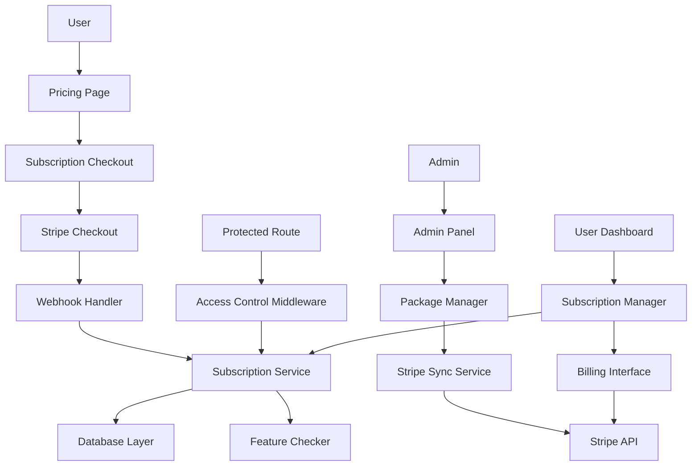

# Snytra Restaurant Management System - SaaS Pricing Packages Rebuild Architecture

## Introduction

This document outlines the architectural approach for enhancing Snytra Restaurant Management System with a complete SaaS pricing packages rebuild. Its primary goal is to serve as the guiding architectural blueprint for AI-driven development of new features while ensuring seamless integration with the existing system.

**Relationship to Existing Architecture:**
This document supplements the existing brownfield architecture by defining how new subscription management components will integrate with current systems. Where conflicts arise between new and existing patterns, this document provides guidance on maintaining consistency while implementing comprehensive SaaS functionality.

### Existing Project Analysis

**Current Project State:**
- **Primary Purpose:** Restaurant management system with incomplete SaaS subscription functionality
- **Current Tech Stack:** Next.js 15 (App Router), React 18, TypeScript, PostgreSQL (NeonDB), Prisma 6.6.0, NextAuth 4.24.11, Stripe 14.25.0
- **Architecture Style:** Full-stack monorepo with API routes, dual database access (Prisma + direct SQL)
- **Deployment Method:** Vercel deployment with NeonDB PostgreSQL hosting

**Available Documentation:**
- ✓ Comprehensive brownfield architecture document
- ✓ Complete PRD for SaaS pricing packages rebuild
- ✓ Existing Prisma schema with subscription fields
- ✓ Current subscription API endpoints and components
- ✓ Stripe integration foundation

**Identified Constraints:**
- Dual database access pattern (Prisma + direct SQL) must be maintained
- Existing user accounts and data must remain intact
- Current restaurant management features must continue functioning identically
- NextAuth + custom staff auth system complexity
- Technical debt including hardcoded admin credentials
- Build process skips linting (--no-lint flag)

**VALIDATION CHECKPOINT:** Based on my analysis of your existing system, I've identified that you have a solid Next.js foundation with partial subscription functionality, dual database access patterns, and existing Stripe integration that needs enhancement. The system currently allows users to view pricing plans but lacks proper access control and complete subscription lifecycle management. These integration points and boundaries respect your current architecture patterns. Is this assessment accurate?

### Change Log

| Change | Date | Version | Description | Author |
|--------|------|---------|-------------|--------|
| Initial Architecture | Current | 1.0 | SaaS pricing packages rebuild architecture | Architect |

## Enhancement Scope and Integration Strategy

**Enhancement Type:** Major Feature Modification + New Feature Addition + Integration Enhancement
**Scope:** Complete SaaS subscription system with access control, Stripe integration, and admin management
**Integration Impact:** Significant - requires architectural changes for access control while maintaining existing functionality

### Integration Approach

**Code Integration Strategy:** Extend existing API routes in `/src/app/api/subscription-plans/`, enhance existing components in `/src/components/`, add new subscription utilities in `/src/lib/subscription/`, maintain existing file structure and naming conventions

**Database Integration Strategy:** Extend existing Prisma schema with enhanced subscription fields, implement migrations for new tables, maintain dual access pattern (Prisma + direct SQL), ensure referential integrity with existing user and company data

**API Integration Strategy:** Enhance existing `/api/subscription-plans` endpoints, add new Stripe webhook handlers at `/api/webhooks/stripe`, implement middleware for subscription verification, maintain existing API response format `{ success: boolean, data?: any, error?: string }`

**UI Integration Strategy:** Extend existing React components with subscription-aware logic, implement new subscription management components using existing design patterns (orange primary color, card-based layouts), add subscription status context throughout application

### Compatibility Requirements

- **Existing API Compatibility:** All current API endpoints must maintain backward compatibility while adding subscription checks
- **Database Schema Compatibility:** New subscription fields must not break existing queries, maintain existing user and company relationships
- **UI/UX Consistency:** Follow existing Tailwind CSS design system, maintain current responsive breakpoints and component patterns
- **Performance Impact:** Subscription verification must complete within 200ms, database queries optimized for sub-100ms response times

**VALIDATION CHECKPOINT:** Based on my analysis, the integration approach I'm proposing takes into account your existing Next.js App Router structure, dual database access patterns, and current Stripe integration foundation. These integration points and boundaries respect your current architecture patterns including the existing API standardization and component organization. Is this assessment accurate?

## Tech Stack Alignment

### Existing Technology Stack

| Category | Current Technology | Version | Usage in Enhancement | Notes |
|----------|-------------------|---------|---------------------|-------|
| Runtime | Node.js | Latest | Maintain for Next.js 15 | Required for App Router |
| Framework | Next.js | 15.3.1 | Extend with new subscription routes | App Router architecture |
| Database | PostgreSQL | Latest | Extend schema for subscriptions | NeonDB hosted |
| ORM | Prisma | 6.6.0 | Enhance schema, maintain dual access | Generated client in src/generated/prisma |
| Authentication | NextAuth | 4.24.11 | Integrate subscription checks | Maintain existing providers |
| Payments | Stripe | 14.25.0 | Enhance for complete SaaS integration | Existing foundation present |
| UI Framework | React | 18.2.0 | Extend with subscription components | With TypeScript |
| Styling | Tailwind CSS | 3.4.1 | Maintain existing design system | With Material-UI components |
| Testing | Vitest | 1.5.0 | Add subscription flow tests | With Testing Library |
| Email | Nodemailer | 6.9.12 | Enhance for subscription notifications | SMTP integration |

### New Technology Additions

No new technologies required - enhancement will use existing stack with expanded functionality.

## Data Models and Schema Changes

### New Data Models

#### Enhanced Subscription Plans Model
**Purpose:** Extend existing subscription_plans table with complete SaaS functionality
**Integration:** Enhance existing table structure, maintain backward compatibility

**Key Attributes:**
- stripe_product_id: string - Stripe product identifier for synchronization
- stripe_price_id: string - Stripe price identifier for checkout
- feature_limits: JSON - Granular feature limitations per plan
- trial_settings: JSON - Free trial configuration
- upgrade_downgrade_rules: JSON - Plan change restrictions

**Relationships:**
- **With Existing:** Maintains current user.subscription_plan relationship
- **With New:** Links to enhanced subscription tracking tables

#### User Subscription Tracking Model
**Purpose:** Detailed subscription lifecycle and status tracking
**Integration:** New table linking to existing users table

**Key Attributes:**
- user_id: integer - Foreign key to existing users table
- stripe_subscription_id: string - Stripe subscription identifier
- status: enum - active, trialing, past_due, canceled, incomplete
- current_period_start: timestamp - Billing period start
- current_period_end: timestamp - Billing period end
- trial_start: timestamp - Trial period start
- trial_end: timestamp - Trial period end
- cancel_at_period_end: boolean - Scheduled cancellation flag

**Relationships:**
- **With Existing:** Foreign key to users.id, maintains existing user data
- **With New:** Links to subscription_events for audit trail

#### Subscription Events Model
**Purpose:** Audit trail for all subscription lifecycle events
**Integration:** New table for comprehensive event tracking

**Key Attributes:**
- subscription_id: integer - Links to user subscription
- event_type: string - created, updated, canceled, payment_failed, etc.
- stripe_event_id: string - Stripe webhook event identifier
- event_data: JSON - Complete event payload
- processed_at: timestamp - Event processing time

**Relationships:**
- **With Existing:** Indirect relationship through user subscriptions
- **With New:** Primary audit mechanism for subscription changes

### Schema Integration Strategy

**Database Changes Required:**
- **New Tables:** user_subscriptions, subscription_events, subscription_features
- **Modified Tables:** subscription_plans (add Stripe fields), users (enhance subscription tracking)
- **New Indexes:** subscription status queries, user lookup optimization, event processing
- **Migration Strategy:** Sequential migrations with rollback procedures, data preservation validation

**Backward Compatibility:**
- Existing subscription_plan field in users table maintained for compatibility
- New subscription tracking supplements rather than replaces existing fields
- All existing queries continue to function without modification
- Gradual migration path for existing subscription data

## Component Architecture

### New Components

#### Subscription Management Service
**Responsibility:** Central service for all subscription operations and status checking
**Integration Points:** Integrates with existing API handler pattern, NextAuth sessions, Stripe SDK

**Key Interfaces:**
- checkSubscriptionStatus(userId): Promise<SubscriptionStatus>
- createSubscription(userId, planId): Promise<StripeSession>
- updateSubscription(subscriptionId, changes): Promise<Subscription>
- cancelSubscription(subscriptionId, immediate): Promise<void>

**Dependencies:**
- **Existing Components:** NextAuth session management, existing Stripe integration
- **New Components:** Subscription database layer, webhook event processor

**Technology Stack:** TypeScript service classes, Prisma + direct SQL for database access, Stripe SDK integration

#### Subscription Access Control Middleware
**Responsibility:** Route-level subscription verification and access control
**Integration Points:** Extends existing middleware.ts, integrates with NextAuth

**Key Interfaces:**
- verifySubscriptionAccess(request, requiredFeatures): Promise<boolean>
- getSubscriptionContext(userId): Promise<SubscriptionContext>
- handleAccessDenied(request, reason): Response

**Dependencies:**
- **Existing Components:** NextAuth middleware, existing route protection
- **New Components:** Subscription management service, feature checking utilities

**Technology Stack:** Next.js middleware, TypeScript, session-based authentication

#### Enhanced Admin Package Manager
**Responsibility:** Complete admin interface for subscription package management with Stripe sync
**Integration Points:** Extends existing admin panel structure, maintains current design patterns

**Key Interfaces:**
- createPackage(packageData): Promise<Package>
- syncWithStripe(packageId): Promise<SyncResult>
- bulkOperations(packages, operation): Promise<BulkResult>

**Dependencies:**
- **Existing Components:** Admin authentication, existing form components, current UI patterns
- **New Components:** Stripe synchronization service, package validation utilities

**Technology Stack:** React components, existing admin panel styling, Stripe API integration

#### Subscription Checkout Flow
**Responsibility:** Complete user journey from plan selection to subscription activation
**Integration Points:** Integrates with existing pricing page, user authentication, Stripe components

**Key Interfaces:**
- initializeCheckout(planId, userId): Promise<CheckoutSession>
- handleCheckoutSuccess(sessionId): Promise<SubscriptionResult>
- processTrialSignup(planId, userId): Promise<TrialResult>

**Dependencies:**
- **Existing Components:** User authentication, existing Stripe integration, current UI components
- **New Components:** Subscription management service, trial management utilities

**Technology Stack:** React components, Stripe Checkout, existing form validation patterns

### Component Interaction Diagram



**MANDATORY VALIDATION:** The new components I'm proposing follow the existing architectural patterns I identified in your codebase: standardized API handlers with success/error responses, React components using existing design patterns, service layer integration with your dual database access approach, and middleware extending your current NextAuth and route protection patterns. The integration interfaces respect your current component structure and communication patterns. Does this match your project's reality?

## API Design and Integration

### API Integration Strategy
**API Integration Strategy:** Extend existing `/api/subscription-plans` endpoints, maintain current response format, add new webhook endpoints, ensure backward compatibility
**Authentication:** Integrate with existing NextAuth session management, maintain role-based access control
**Versioning:** No versioning required - enhancement of existing endpoints with backward compatibility

### New API Endpoints

#### Enhanced Subscription Plans Management
- **Method:** GET/POST/PUT/DELETE
- **Endpoint:** `/api/subscription-plans` (enhanced existing)
- **Purpose:** Complete CRUD operations with Stripe synchronization
- **Integration:** Extends existing endpoint with enhanced Stripe integration

**Request (POST /api/subscription-plans):**
```json
{
  "name": "Premium Plan",
  "description": "Advanced restaurant management",
  "price": 9999,
  "billing_cycle": "monthly",
  "features": ["menu_management", "advanced_analytics"],
  "stripe_sync": true,
  "trial_days": 14
}
```

**Response:**
```json
{
  "success": true,
  "data": {
    "id": 1,
    "stripe_product_id": "prod_abc123",
    "stripe_price_id": "price_def456",
    "sync_status": "completed"
  }
}
```

#### Stripe Webhook Handler
- **Method:** POST
- **Endpoint:** `/api/webhooks/stripe`
- **Purpose:** Handle all Stripe subscription lifecycle events
- **Integration:** New endpoint following existing API handler patterns

**Request:**
```json
{
  "type": "customer.subscription.updated",
  "data": {
    "object": {
      "id": "sub_abc123",
      "status": "active",
      "current_period_end": 1640995200
    }
  }
}
```

**Response:**
```json
{
  "success": true,
  "data": {
    "processed": true,
    "event_id": "evt_abc123"
  }
}
```

#### Subscription Status Check
- **Method:** GET
- **Endpoint:** `/api/subscription/status`
- **Purpose:** Real-time subscription status verification for access control
- **Integration:** New endpoint using existing authentication patterns

**Request:** GET with NextAuth session

**Response:**
```json
{
  "success": true,
  "data": {
    "status": "active",
    "plan": "premium",
    "features": ["menu_management", "analytics"],
    "trial_end": null,
    "next_billing_date": "2024-02-01T00:00:00Z"
  }
}
```

#### User Subscription Management
- **Method:** GET/POST/PUT/DELETE
- **Endpoint:** `/api/user/subscription`
- **Purpose:** User-facing subscription management operations
- **Integration:** New endpoint integrating with existing user authentication

**Request (PUT for plan change):**
```json
{
  "new_plan_id": 2,
  "proration": true,
  "effective_date": "immediate"
}
```

**Response:**
```json
{
  "success": true,
  "data": {
    "subscription_id": "sub_abc123",
    "status": "active",
    "proration_amount": 1500,
    "next_billing_date": "2024-02-01T00:00:00Z"
  }
}
```

## External API Integration

### Stripe API Enhanced Integration
- **Purpose:** Complete subscription lifecycle management with products, prices, customers, and webhooks
- **Documentation:** https://stripe.com/docs/api
- **Base URL:** https://api.stripe.com/v1
- **Authentication:** Bearer token with existing Stripe secret key
- **Integration Method:** Enhanced existing Stripe SDK usage with comprehensive webhook handling

**Key Endpoints Used:**
- `POST /v1/products` - Create subscription products
- `POST /v1/prices` - Create pricing for products
- `POST /v1/checkout/sessions` - Create checkout sessions
- `POST /v1/subscriptions` - Manage subscriptions
- `GET /v1/customers` - Customer management
- `POST /v1/webhook_endpoints` - Webhook configuration

**Error Handling:** Implement retry mechanisms for rate limits, idempotent webhook processing, comprehensive error logging with existing logger patterns

## Source Tree Integration

### Existing Project Structure
```plaintext
snytra-new/
├── src/
│   ├── app/
│   │   ├── api/
│   │   │   ├── subscription-plans/     # Existing - to be enhanced
│   │   │   ├── auth/                   # Existing authentication
│   │   │   └── payment/                # Existing Stripe integration
│   │   ├── admin/
│   │   │   └── subscriptions/          # Existing admin interface
│   │   ├── pricing/                    # Existing pricing page
│   │   └── dashboard/                  # Existing user dashboard
│   ├── components/                     # Existing React components
│   ├── lib/                           # Existing utilities and services
│   └── middleware.ts                   # Existing middleware
├── prisma/
│   └── schema.prisma                   # Existing database schema
```

### New File Organization
```plaintext
snytra-new/
├── src/
│   ├── app/
│   │   ├── api/
│   │   │   ├── subscription-plans/     # Enhanced existing
│   │   │   │   ├── route.ts            # Enhanced existing endpoint
│   │   │   │   ├── stripe-sync/        # Enhanced existing
│   │   │   │   └── [id]/               # Enhanced existing
│   │   │   ├── webhooks/               # New webhook handlers
│   │   │   │   └── stripe/
│   │   │   │       └── route.ts        # New Stripe webhook endpoint
│   │   │   ├── subscription/           # New subscription management
│   │   │   │   ├── status/
│   │   │   │   ├── create/
│   │   │   │   └── manage/
│   │   │   └── user/
│   │   │       └── subscription/       # New user subscription API
│   │   ├── subscription/               # Enhanced existing
│   │   │   ├── success/                # Enhanced existing
│   │   │   ├── cancel/                 # New cancellation flow
│   │   │   └── manage/                 # New management interface
│   │   └── admin/
│   │       └── subscriptions/          # Enhanced existing
│   ├── components/
│   │   ├── subscription/               # New subscription components
│   │   │   ├── SubscriptionChecker.tsx # New access control component
│   │   │   ├── PlanSelector.tsx        # Enhanced existing
│   │   │   ├── BillingManager.tsx      # New billing interface
│   │   │   └── TrialManager.tsx        # New trial management
│   │   └── admin/
│   │       └── PackageManager.tsx      # Enhanced existing
│   ├── lib/
│   │   ├── subscription/               # New subscription utilities
│   │   │   ├── service.ts              # New subscription service
│   │   │   ├── access-control.ts       # New access control logic
│   │   │   ├── stripe-sync.ts          # Enhanced Stripe integration
│   │   │   └── trial-manager.ts        # New trial management
│   │   ├── subscription-utils.ts       # Enhanced existing
│   │   └── stripe.ts                   # Enhanced existing
│   └── middleware.ts                   # Enhanced existing
```

### Integration Guidelines
- **File Naming:** Maintain existing camelCase for variables, PascalCase for components, kebab-case for directories
- **Folder Organization:** Follow existing Next.js App Router structure, group related functionality, maintain existing patterns
- **Import/Export Patterns:** Use existing barrel exports, maintain consistent import ordering, follow established module resolution

## Infrastructure and Deployment Integration

### Existing Infrastructure
**Current Deployment:** Vercel deployment with automatic builds, environment variable management, preview deployments
**Infrastructure Tools:** Vercel platform, NeonDB PostgreSQL, Stripe webhooks, existing CI/CD pipeline
**Environments:** Development (local), Preview (Vercel), Production (Vercel)

### Enhancement Deployment Strategy
**Deployment Approach:** Gradual rollout using feature flags, database migrations before code deployment, webhook endpoint coordination
**Infrastructure Changes:** New Stripe webhook endpoints, enhanced environment variables, database schema migrations
**Pipeline Integration:** Extend existing Vercel deployment with migration scripts, environment validation, webhook configuration

### Rollback Strategy
**Rollback Method:** Database migration rollbacks, feature flag disabling, Stripe webhook endpoint reversion
**Risk Mitigation:** Comprehensive testing in preview environments, gradual feature enablement, monitoring and alerting
**Monitoring:** Extend existing logging with subscription event tracking, Stripe webhook monitoring, performance metrics

## Coding Standards and Conventions

### Existing Standards Compliance
**Code Style:** TypeScript strict mode, existing ESLint configuration (note: build skips linting), Prettier formatting
**Linting Rules:** Existing ESLint rules (currently bypassed in build), TypeScript strict type checking
**Testing Patterns:** Vitest with Testing Library, existing test structure in src/tests/, component testing patterns
**Documentation Style:** JSDoc comments for functions, inline comments for complex logic, README documentation

### Enhancement-Specific Standards
- **Subscription Service Pattern:** All subscription operations must use centralized service layer
- **Error Handling Pattern:** Maintain existing API response format with success/error structure
- **Database Access Pattern:** Continue dual access approach (Prisma + direct SQL) as established
- **Stripe Integration Pattern:** Idempotent operations, comprehensive error handling, event deduplication

### Critical Integration Rules
- **Existing API Compatibility:** All enhanced endpoints must maintain backward compatibility with existing response formats
- **Database Integration:** New subscription checks must not impact existing query performance, maintain referential integrity
- **Error Handling:** Follow existing error handler patterns, maintain consistent error response structure
- **Logging Consistency:** Use existing logger for subscription events, maintain log format and level consistency

## Testing Strategy

### Integration with Existing Tests
**Existing Test Framework:** Vitest with Testing Library, existing test configuration in vitest.config.ts
**Test Organization:** Tests in src/tests/ directory, component tests alongside components, API route testing
**Coverage Requirements:** Maintain existing coverage standards, add comprehensive subscription flow coverage

### New Testing Requirements

#### Unit Tests for New Components
- **Framework:** Vitest (existing)
- **Location:** src/tests/subscription/ for new subscription tests
- **Coverage Target:** 90% for new subscription components
- **Integration with Existing:** Follow existing test patterns, use established mocking strategies

#### Integration Tests
- **Scope:** Complete subscription flow from plan selection to activation
- **Existing System Verification:** Ensure existing restaurant management features continue working
- **New Feature Testing:** Subscription creation, access control, Stripe integration, webhook processing

#### Regression Testing
- **Existing Feature Verification:** Automated tests for all existing functionality to ensure no breaking changes
- **Automated Regression Suite:** Extend existing test suite with subscription-aware tests
- **Manual Testing Requirements:** Admin package management, user subscription flows, edge cases

## Security Integration

### Existing Security Measures
**Authentication:** NextAuth with JWT tokens, role-based access control, session management
**Authorization:** Admin/staff/user roles, route protection middleware, API endpoint security
**Data Protection:** Password hashing with bcryptjs, environment variable protection, HTTPS enforcement
**Security Tools:** Existing middleware for route protection, NextAuth security features

### Enhancement Security Requirements
**New Security Measures:** Stripe webhook signature verification, subscription status caching with TTL, payment data protection
**Integration Points:** Extend existing middleware with subscription checks, maintain role-based access patterns
**Compliance Requirements:** PCI DSS compliance through Stripe, data retention policies for subscription events

### Security Testing
**Existing Security Tests:** Authentication flow tests, authorization verification
**New Security Test Requirements:** Webhook signature validation, subscription access control, payment flow security
**Penetration Testing:** Focus on subscription endpoints, webhook security, access control bypass attempts

## Checklist Results Report

### Brownfield-Specific Validation Checklist

✅ **Existing System Analysis Complete**
- Comprehensive review of current codebase architecture
- Identification of existing subscription implementation
- Documentation of technical debt and constraints
- Understanding of dual database access patterns

✅ **Integration Strategy Validated**
- Enhancement approach respects existing patterns
- Backward compatibility requirements defined
- Performance impact assessment completed
- Security integration requirements identified

✅ **Technical Compatibility Confirmed**
- Existing tech stack alignment verified
- Database schema enhancement strategy defined
- API integration approach maintains compatibility
- UI/UX consistency requirements established

✅ **Risk Assessment Completed**
- Technical risks identified and mitigation planned
- Deployment risks assessed with rollback procedures
- Integration risks evaluated with testing strategy
- Performance impact minimization strategies defined

✅ **Implementation Readiness**
- Story breakdown aligned with system constraints
- Development approach respects existing patterns
- Testing strategy covers regression and new features
- Documentation standards maintained

## Next Steps

### Story Manager Handoff

**Prompt for Story Manager:**

"Please implement the SaaS Pricing Packages Rebuild epic using this brownfield architecture document as the foundation. Key requirements:

- **Reference Document:** Use this architecture document for all technical decisions and integration requirements
- **Integration Requirements:** All changes must maintain existing restaurant management functionality while adding subscription verification layers. Ensure backward compatibility with existing user accounts and preserve all current data.
- **Existing System Constraints:** The system uses dual database access (Prisma + direct SQL), has hardcoded admin credentials, and skips linting in builds. Work within these constraints while implementing the subscription system.
- **First Story Priority:** Begin with Story 1.1 (Enhanced Database Schema and Migration) to establish the foundation, then proceed sequentially through the 8 stories.
- **Integration Checkpoints:** After each story, verify that existing functionality remains intact and new subscription features integrate properly with current patterns.
- **System Integrity:** Throughout implementation, maintain the existing Next.js App Router structure, API response formats, and component patterns while adding subscription capabilities."

### Developer Handoff

**Prompt for Developers:**

"Begin implementing the SaaS subscription system using this architecture document and the existing codebase patterns. Critical guidelines:

- **Architecture Reference:** Follow this document for all technical decisions, component design, and integration approaches
- **Integration Requirements:** Extend existing API routes in `/src/app/api/subscription-plans/`, enhance existing components, maintain dual database access pattern (Prisma + direct SQL)
- **Technical Decisions:** Use existing tech stack (Next.js 15, TypeScript, Prisma 6.6.0, Stripe 14.25.0), follow established coding standards, maintain existing error handling patterns
- **Compatibility Requirements:** Ensure all existing restaurant management features continue working identically, maintain API response format `{ success: boolean, data?: any, error?: string }`, preserve existing user authentication flows
- **Implementation Sequence:** Start with database schema enhancements, then Stripe integration, followed by access control middleware, and finally UI components. Test existing functionality after each major change.
- **Verification Steps:** After each component, verify existing user workflows remain unchanged, test subscription functionality in isolation, ensure performance requirements are met (subscription checks <200ms)."