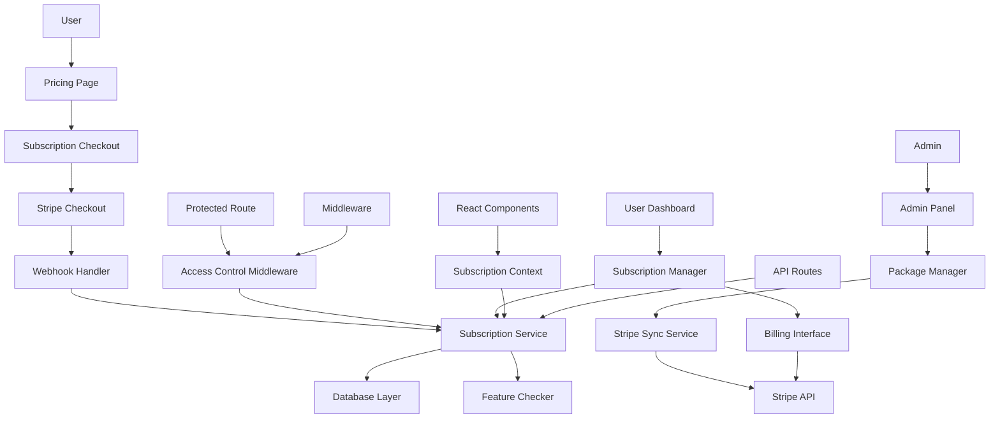

# Snytra SaaS Pricing Packages - Component Architecture

## Introduction

This document details the component architecture for the SaaS pricing packages rebuild. It focuses on new components and their integration with existing system components while maintaining architectural consistency.

## Related Documents

- **Architecture Overview** - High-level approach and integration strategy
- **Data Models and Schema** - Database design and schema changes
- **API Design and Integration** - API endpoints and external integrations
- **Component Architecture** (this document) - Component design and interaction patterns
- **Infrastructure and Deployment** - Deployment strategy and infrastructure changes
- **Testing and Security** - Testing strategy and security requirements

## Component Architecture Overview

### New Components

#### Subscription Management Service
**Responsibility:** Central service for all subscription operations and status checking
**Integration Points:** Integrates with existing API handler pattern, NextAuth sessions, Stripe SDK
**Location:** `/src/lib/subscription/service.ts`

**Key Interfaces:**
```typescript
interface SubscriptionService {
  checkSubscriptionStatus(userId: number): Promise<SubscriptionStatus>;
  createSubscription(userId: number, planId: number): Promise<StripeSession>;
  updateSubscription(subscriptionId: string, changes: SubscriptionUpdate): Promise<Subscription>;
  cancelSubscription(subscriptionId: string, immediate: boolean): Promise<void>;
  syncWithStripe(subscriptionId: string): Promise<SyncResult>;
  getUsageMetrics(userId: number): Promise<UsageMetrics>;
}

interface SubscriptionStatus {
  isActive: boolean;
  plan: SubscriptionPlan;
  features: FeatureAccess;
  limits: FeatureLimits;
  billingInfo: BillingInfo;
  trialInfo?: TrialInfo;
}

interface FeatureAccess {
  [featureKey: string]: boolean;
}

interface FeatureLimits {
  [limitKey: string]: {
    max: number;
    current: number;
    remaining: number;
  };
}
```

**Dependencies:**
- **Existing Components:** NextAuth session management, existing Stripe integration
- **New Components:** Subscription database layer, webhook event processor
- **External Services:** Stripe API, database (Prisma + direct SQL)

**Implementation Example:**
```typescript
export class SubscriptionService {
  constructor(
    private prisma: PrismaClient,
    private stripe: Stripe,
    private cache: CacheService
  ) {}

  async checkSubscriptionStatus(userId: number): Promise<SubscriptionStatus> {
    // Check cache first
    const cacheKey = `subscription:${userId}`;
    const cached = await this.cache.get(cacheKey);
    if (cached) return cached;

    // Fetch from database
    const subscription = await this.prisma.userSubscription.findFirst({
      where: { user_id: userId, status: { in: ['active', 'trialing'] } },
      include: {
        subscription_plan: {
          include: { subscription_features: true }
        }
      }
    });

    if (!subscription) {
      return { isActive: false, plan: null, features: {}, limits: {}, billingInfo: null };
    }

    const status = this.buildSubscriptionStatus(subscription);
    await this.cache.set(cacheKey, status, 300); // 5 minute cache
    return status;
  }

  private buildSubscriptionStatus(subscription: any): SubscriptionStatus {
    const features = subscription.subscription_plan.subscription_features.reduce(
      (acc: any, feature: any) => {
        acc[feature.feature_key] = feature.is_enabled;
        return acc;
      },
      {}
    );

    return {
      isActive: subscription.status === 'active' || subscription.status === 'trialing',
      plan: subscription.subscription_plan,
      features,
      limits: this.calculateLimits(subscription),
      billingInfo: this.buildBillingInfo(subscription),
      trialInfo: this.buildTrialInfo(subscription)
    };
  }
}
```

#### Subscription Access Control Middleware
**Responsibility:** Route-level subscription verification and access control
**Integration Points:** Extends existing middleware.ts, integrates with NextAuth
**Location:** `/src/lib/subscription/access-control.ts`

**Key Interfaces:**
```typescript
interface AccessControlMiddleware {
  verifySubscriptionAccess(request: NextRequest, requiredFeatures: string[]): Promise<boolean>;
  getSubscriptionContext(userId: number): Promise<SubscriptionContext>;
  handleAccessDenied(request: NextRequest, reason: string): Response;
  checkFeatureLimit(userId: number, feature: string, increment?: number): Promise<LimitCheckResult>;
}

interface SubscriptionContext {
  userId: number;
  subscriptionId?: string;
  planId: number;
  features: string[];
  limits: Record<string, number>;
  isTrialing: boolean;
}

interface LimitCheckResult {
  allowed: boolean;
  current: number;
  max: number;
  remaining: number;
}
```

**Dependencies:**
- **Existing Components:** NextAuth middleware, existing route protection
- **New Components:** Subscription management service, feature checking utilities
- **Integration:** Next.js middleware system

**Implementation Example:**
```typescript
export class AccessControlMiddleware {
  constructor(private subscriptionService: SubscriptionService) {}

  async verifySubscriptionAccess(
    request: NextRequest,
    requiredFeatures: string[]
  ): Promise<boolean> {
    const session = await getToken({ req: request });
    if (!session?.sub) return false;

    const userId = parseInt(session.sub);
    const status = await this.subscriptionService.checkSubscriptionStatus(userId);

    if (!status.isActive) return false;

    // Check if user has all required features
    return requiredFeatures.every(feature => status.features[feature]);
  }

  async checkFeatureLimit(
    userId: number,
    feature: string,
    increment: number = 1
  ): Promise<LimitCheckResult> {
    const status = await this.subscriptionService.checkSubscriptionStatus(userId);
    const limit = status.limits[feature];

    if (!limit) {
      return { allowed: true, current: 0, max: Infinity, remaining: Infinity };
    }

    const wouldExceed = limit.current + increment > limit.max;
    return {
      allowed: !wouldExceed,
      current: limit.current,
      max: limit.max,
      remaining: limit.remaining - increment
    };
  }
}

// Middleware integration
export function createSubscriptionMiddleware(config: MiddlewareConfig) {
  return async function subscriptionMiddleware(request: NextRequest) {
    const { pathname } = request.nextUrl;
    
    // Check if route requires subscription
    const routeConfig = config.routes.find(route => 
      pathname.startsWith(route.path)
    );
    
    if (!routeConfig) return NextResponse.next();
    
    const accessControl = new AccessControlMiddleware(subscriptionService);
    const hasAccess = await accessControl.verifySubscriptionAccess(
      request,
      routeConfig.requiredFeatures
    );
    
    if (!hasAccess) {
      return accessControl.handleAccessDenied(request, 'subscription_required');
    }
    
    return NextResponse.next();
  };
}
```

#### Enhanced Admin Package Manager
**Responsibility:** Complete admin interface for subscription package management with Stripe sync
**Integration Points:** Extends existing admin panel structure, maintains current design patterns
**Location:** `/src/components/admin/PackageManager.tsx`

**Key Interfaces:**
```typescript
interface PackageManagerProps {
  initialPackages?: SubscriptionPlan[];
  onPackageCreate?: (package: SubscriptionPlan) => void;
  onPackageUpdate?: (package: SubscriptionPlan) => void;
  onPackageDelete?: (packageId: number) => void;
}

interface PackageFormData {
  name: string;
  description: string;
  price: number;
  billing_cycle: 'monthly' | 'yearly';
  features: string[];
  feature_limits: Record<string, number>;
  trial_settings: TrialSettings;
  stripe_sync: boolean;
}

interface TrialSettings {
  trial_enabled: boolean;
  trial_days: number;
}
```

**Dependencies:**
- **Existing Components:** Admin authentication, existing form components, current UI patterns
- **New Components:** Stripe synchronization service, package validation utilities
- **UI Framework:** React components, existing admin panel styling

**Implementation Example:**
```typescript
export function PackageManager({ initialPackages, onPackageCreate }: PackageManagerProps) {
  const [packages, setPackages] = useState<SubscriptionPlan[]>(initialPackages || []);
  const [isCreating, setIsCreating] = useState(false);
  const [syncStatus, setSyncStatus] = useState<Record<number, string>>({});

  const handleCreatePackage = async (formData: PackageFormData) => {
    setIsCreating(true);
    try {
      const response = await fetch('/api/subscription-plans', {
        method: 'POST',
        headers: { 'Content-Type': 'application/json' },
        body: JSON.stringify(formData)
      });

      const result = await response.json();
      if (result.success) {
        const newPackage = result.data;
        setPackages(prev => [...prev, newPackage]);
        onPackageCreate?.(newPackage);
        toast.success('Package created successfully');
      } else {
        toast.error(result.error?.message || 'Failed to create package');
      }
    } catch (error) {
      toast.error('An error occurred while creating the package');
    } finally {
      setIsCreating(false);
    }
  };

  const handleSyncWithStripe = async (packageId: number) => {
    setSyncStatus(prev => ({ ...prev, [packageId]: 'syncing' }));
    try {
      const response = await fetch(`/api/subscription-plans/${packageId}/stripe-sync`, {
        method: 'POST'
      });

      const result = await response.json();
      if (result.success) {
        setSyncStatus(prev => ({ ...prev, [packageId]: 'completed' }));
        toast.success('Stripe sync completed');
      } else {
        setSyncStatus(prev => ({ ...prev, [packageId]: 'failed' }));
        toast.error('Stripe sync failed');
      }
    } catch (error) {
      setSyncStatus(prev => ({ ...prev, [packageId]: 'failed' }));
      toast.error('Sync error occurred');
    }
  };

  return (
    <div className="space-y-6">
      <div className="flex justify-between items-center">
        <h2 className="text-2xl font-bold text-gray-900">Subscription Packages</h2>
        <button
          onClick={() => setIsCreating(true)}
          className="bg-orange-600 text-white px-4 py-2 rounded-md hover:bg-orange-700"
        >
          Create Package
        </button>
      </div>

      <div className="grid gap-6 md:grid-cols-2 lg:grid-cols-3">
        {packages.map(pkg => (
          <PackageCard
            key={pkg.id}
            package={pkg}
            syncStatus={syncStatus[pkg.id]}
            onSync={() => handleSyncWithStripe(pkg.id)}
            onEdit={(pkg) => handleEditPackage(pkg)}
            onDelete={(id) => handleDeletePackage(id)}
          />
        ))}
      </div>

      {isCreating && (
        <PackageCreateModal
          onSubmit={handleCreatePackage}
          onClose={() => setIsCreating(false)}
        />
      )}
    </div>
  );
}
```

#### Subscription Checkout Flow
**Responsibility:** Complete user journey from plan selection to subscription activation
**Integration Points:** Integrates with existing pricing page, user authentication, Stripe components
**Location:** `/src/components/subscription/CheckoutFlow.tsx`

**Key Interfaces:**
```typescript
interface CheckoutFlowProps {
  selectedPlan?: SubscriptionPlan;
  user?: User;
  onSuccess?: (subscription: Subscription) => void;
  onCancel?: () => void;
}

interface CheckoutStep {
  id: string;
  title: string;
  component: React.ComponentType<any>;
  isComplete: boolean;
  isActive: boolean;
}

interface CheckoutState {
  currentStep: number;
  selectedPlan: SubscriptionPlan | null;
  paymentMethod: PaymentMethod | null;
  isProcessing: boolean;
  error: string | null;
}
```

**Dependencies:**
- **Existing Components:** User authentication, existing Stripe integration, current UI components
- **New Components:** Subscription management service, trial management utilities
- **External Services:** Stripe Checkout, payment processing

**Implementation Example:**
```typescript
export function CheckoutFlow({ selectedPlan, user, onSuccess }: CheckoutFlowProps) {
  const [state, setState] = useState<CheckoutState>({
    currentStep: 0,
    selectedPlan,
    paymentMethod: null,
    isProcessing: false,
    error: null
  });

  const steps: CheckoutStep[] = [
    {
      id: 'plan-selection',
      title: 'Choose Plan',
      component: PlanSelectionStep,
      isComplete: !!state.selectedPlan,
      isActive: state.currentStep === 0
    },
    {
      id: 'payment-method',
      title: 'Payment Method',
      component: PaymentMethodStep,
      isComplete: !!state.paymentMethod,
      isActive: state.currentStep === 1
    },
    {
      id: 'confirmation',
      title: 'Confirmation',
      component: ConfirmationStep,
      isComplete: false,
      isActive: state.currentStep === 2
    }
  ];

  const handleStepComplete = (stepData: any) => {
    setState(prev => ({ ...prev, ...stepData }));
    if (state.currentStep < steps.length - 1) {
      setState(prev => ({ ...prev, currentStep: prev.currentStep + 1 }));
    }
  };

  const handleCheckoutSubmit = async () => {
    if (!state.selectedPlan || !user) return;

    setState(prev => ({ ...prev, isProcessing: true, error: null }));

    try {
      const response = await fetch('/api/subscription/checkout', {
        method: 'POST',
        headers: { 'Content-Type': 'application/json' },
        body: JSON.stringify({
          plan_id: state.selectedPlan.id,
          success_url: `${window.location.origin}/subscription/success`,
          cancel_url: `${window.location.origin}/pricing`,
          trial: state.selectedPlan.trial_settings?.trial_enabled
        })
      });

      const result = await response.json();
      if (result.success) {
        // Redirect to Stripe Checkout
        window.location.href = result.data.checkout_url;
      } else {
        setState(prev => ({ 
          ...prev, 
          error: result.error?.message || 'Checkout failed',
          isProcessing: false 
        }));
      }
    } catch (error) {
      setState(prev => ({ 
        ...prev, 
        error: 'An error occurred during checkout',
        isProcessing: false 
      }));
    }
  };

  const CurrentStepComponent = steps[state.currentStep].component;

  return (
    <div className="max-w-4xl mx-auto p-6">
      {/* Progress Indicator */}
      <div className="mb-8">
        <div className="flex items-center justify-between">
          {steps.map((step, index) => (
            <div
              key={step.id}
              className={`flex items-center ${
                index < steps.length - 1 ? 'flex-1' : ''
              }`}
            >
              <div
                className={`w-8 h-8 rounded-full flex items-center justify-center ${
                  step.isComplete
                    ? 'bg-green-500 text-white'
                    : step.isActive
                    ? 'bg-orange-500 text-white'
                    : 'bg-gray-300 text-gray-600'
                }`}
              >
                {step.isComplete ? '✓' : index + 1}
              </div>
              <span className="ml-2 text-sm font-medium">{step.title}</span>
              {index < steps.length - 1 && (
                <div className="flex-1 h-0.5 bg-gray-300 mx-4" />
              )}
            </div>
          ))}
        </div>
      </div>

      {/* Error Display */}
      {state.error && (
        <div className="mb-6 p-4 bg-red-50 border border-red-200 rounded-md">
          <p className="text-red-800">{state.error}</p>
        </div>
      )}

      {/* Current Step Content */}
      <div className="bg-white rounded-lg shadow-md p-6">
        <CurrentStepComponent
          state={state}
          onComplete={handleStepComplete}
          onSubmit={handleCheckoutSubmit}
          isProcessing={state.isProcessing}
        />
      </div>
    </div>
  );
}
```

### Component Interaction Diagram



### Integration with Existing Components

#### Enhanced Pricing Page Component
**Location:** `/src/app/pricing/page.tsx` (enhanced existing)
**Integration:** Add subscription status awareness and checkout integration

```typescript
// Enhanced pricing page with subscription awareness
export default function PricingPage() {
  const { data: session } = useSession();
  const [currentSubscription, setCurrentSubscription] = useState<Subscription | null>(null);
  const [isLoading, setIsLoading] = useState(true);

  useEffect(() => {
    if (session?.user) {
      fetchCurrentSubscription();
    } else {
      setIsLoading(false);
    }
  }, [session]);

  const fetchCurrentSubscription = async () => {
    try {
      const response = await fetch('/api/subscription/status');
      const result = await response.json();
      if (result.success) {
        setCurrentSubscription(result.data);
      }
    } catch (error) {
      console.error('Failed to fetch subscription:', error);
    } finally {
      setIsLoading(false);
    }
  };

  return (
    <div className="pricing-page">
      <PricingHeader />
      <PricingPlans 
        currentSubscription={currentSubscription}
        isAuthenticated={!!session}
        onPlanSelect={handlePlanSelection}
      />
      <PricingFAQ />
    </div>
  );
}
```

#### Subscription-Aware Navigation
**Location:** `/src/components/Navigation.tsx` (enhanced existing)
**Integration:** Add subscription status indicators and upgrade prompts

```typescript
// Enhanced navigation with subscription awareness
export function Navigation() {
  const { data: session } = useSession();
  const { subscription, isLoading } = useSubscription();

  return (
    <nav className="bg-white shadow-md">
      <div className="max-w-7xl mx-auto px-4">
        <div className="flex justify-between items-center h-16">
          <Logo />
          
          <div className="flex items-center space-x-4">
            {session && (
              <>
                <SubscriptionStatusBadge subscription={subscription} />
                <NotificationBell />
                <UserMenu />
              </>
            )}
            {!session && (
              <>
                <Link href="/login" className="text-gray-600 hover:text-gray-900">
                  Sign In
                </Link>
                <Link href="/register" className="bg-orange-600 text-white px-4 py-2 rounded-md">
                  Get Started
                </Link>
              </>
            )}
          </div>
        </div>
      </div>
    </nav>
  );
}

function SubscriptionStatusBadge({ subscription }: { subscription: Subscription | null }) {
  if (!subscription) return null;

  const getBadgeColor = () => {
    switch (subscription.status) {
      case 'active': return 'bg-green-100 text-green-800';
      case 'trialing': return 'bg-blue-100 text-blue-800';
      case 'past_due': return 'bg-yellow-100 text-yellow-800';
      default: return 'bg-gray-100 text-gray-800';
    }
  };

  return (
    <span className={`px-2 py-1 rounded-full text-xs font-medium ${getBadgeColor()}`}>
      {subscription.plan.name}
      {subscription.status === 'trialing' && ' (Trial)'}
    </span>
  );
}
```

### Shared Utilities and Hooks

#### useSubscription Hook
**Location:** `/src/hooks/useSubscription.ts`
**Purpose:** Centralized subscription state management

```typescript
export function useSubscription() {
  const { data: session } = useSession();
  const [subscription, setSubscription] = useState<Subscription | null>(null);
  const [isLoading, setIsLoading] = useState(true);
  const [error, setError] = useState<string | null>(null);

  const fetchSubscription = useCallback(async () => {
    if (!session?.user) {
      setSubscription(null);
      setIsLoading(false);
      return;
    }

    try {
      setIsLoading(true);
      const response = await fetch('/api/subscription/status');
      const result = await response.json();
      
      if (result.success) {
        setSubscription(result.data);
        setError(null);
      } else {
        setError(result.error?.message || 'Failed to fetch subscription');
      }
    } catch (err) {
      setError('An error occurred while fetching subscription');
    } finally {
      setIsLoading(false);
    }
  }, [session]);

  useEffect(() => {
    fetchSubscription();
  }, [fetchSubscription]);

  const hasFeature = useCallback((feature: string) => {
    return subscription?.features?.[feature] || false;
  }, [subscription]);

  const checkLimit = useCallback((limitKey: string) => {
    const limit = subscription?.limits?.[limitKey];
    return limit ? {
      current: limit.current,
      max: limit.max,
      remaining: limit.remaining,
      isAtLimit: limit.remaining <= 0
    } : null;
  }, [subscription]);

  return {
    subscription,
    isLoading,
    error,
    hasFeature,
    checkLimit,
    refetch: fetchSubscription
  };
}
```

#### Subscription Context Provider
**Location:** `/src/context/SubscriptionContext.tsx`
**Purpose:** Global subscription state management

```typescript
interface SubscriptionContextType {
  subscription: Subscription | null;
  isLoading: boolean;
  error: string | null;
  hasFeature: (feature: string) => boolean;
  checkLimit: (limitKey: string) => LimitInfo | null;
  refetch: () => Promise<void>;
}

const SubscriptionContext = createContext<SubscriptionContextType | undefined>(undefined);

export function SubscriptionProvider({ children }: { children: React.ReactNode }) {
  const subscriptionData = useSubscription();

  return (
    <SubscriptionContext.Provider value={subscriptionData}>
      {children}
    </SubscriptionContext.Provider>
  );
}

export function useSubscriptionContext() {
  const context = useContext(SubscriptionContext);
  if (context === undefined) {
    throw new Error('useSubscriptionContext must be used within a SubscriptionProvider');
  }
  return context;
}
```

### Component Testing Strategy

#### Unit Testing for Subscription Components
```typescript
// Example test for SubscriptionService
describe('SubscriptionService', () => {
  let service: SubscriptionService;
  let mockPrisma: jest.Mocked<PrismaClient>;
  let mockStripe: jest.Mocked<Stripe>;

  beforeEach(() => {
    mockPrisma = createMockPrisma();
    mockStripe = createMockStripe();
    service = new SubscriptionService(mockPrisma, mockStripe, mockCache);
  });

  it('should return active subscription status', async () => {
    mockPrisma.userSubscription.findFirst.mockResolvedValue(mockActiveSubscription);
    
    const status = await service.checkSubscriptionStatus(123);
    
    expect(status.isActive).toBe(true);
    expect(status.plan.name).toBe('Premium Plan');
  });

  it('should handle subscription creation', async () => {
    mockStripe.checkout.sessions.create.mockResolvedValue(mockCheckoutSession);
    
    const session = await service.createSubscription(123, 2);
    
    expect(session.url).toBeDefined();
    expect(mockStripe.checkout.sessions.create).toHaveBeenCalledWith(
      expect.objectContaining({
        mode: 'subscription',
        line_items: expect.any(Array)
      })
    );
  });
});
```

#### Integration Testing for Component Interactions
```typescript
// Example integration test for checkout flow
describe('Checkout Flow Integration', () => {
  it('should complete full checkout process', async () => {
    render(
      <SessionProvider session={mockSession}>
        <SubscriptionProvider>
          <CheckoutFlow selectedPlan={mockPlan} onSuccess={mockOnSuccess} />
        </SubscriptionProvider>
      </SessionProvider>
    );

    // Select plan
    fireEvent.click(screen.getByText('Continue'));
    
    // Enter payment method
    fireEvent.change(screen.getByLabelText('Card Number'), {
      target: { value: '4242424242424242' }
    });
    
    // Submit checkout
    fireEvent.click(screen.getByText('Subscribe Now'));
    
    await waitFor(() => {
      expect(mockOnSuccess).toHaveBeenCalled();
    });
  });
});
```